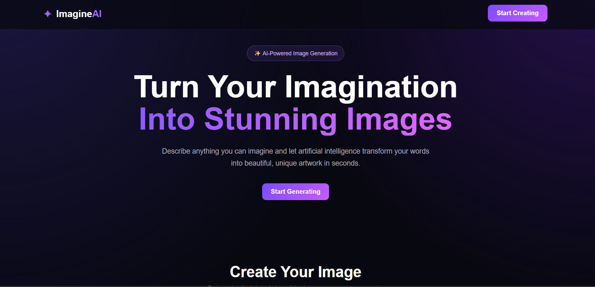
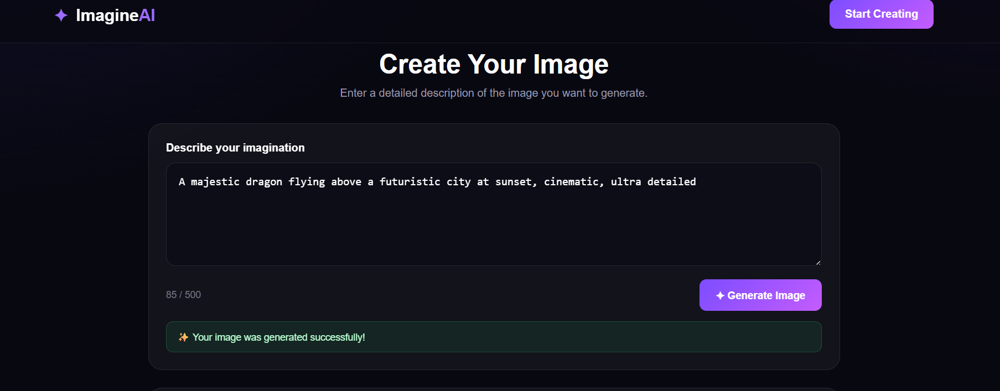

# 🎨 AI Image Generator

An AI-powered web application that transforms text prompts into stunning images using Artificial Intelligence. Built with Python, Flask, JavaScript, and the Hugging Face Inference API.

## ✨ Features

- 🎨 Generate AI images from text prompts
- 📝 User-friendly prompt input system
- 🖼️ Real-time generated image preview
- ⏳ Loading animation during image generation
- 📥 Download generated images
- 📱 Responsive design for different screen sizes
- ⚡ Fast and interactive user experience
- 🔐 Secure API key management using environment variables
- 🎯 Prompt validation and character counter
- 💬 User-friendly success and error messages

## 🖥️ Project Screenshots

### 🏠 Homepage



### ✍️ Enter a Prompt



### 🎨 Generated AI Image


## 🛠️ Technologies Used

### Frontend
- HTML5
- CSS3
- JavaScript

### Backend
- Python
- Flask

### AI Integration
- Hugging Face Inference API
- FLUX.1-schnell text-to-image model

### Additional Tools
- python-dotenv
- Pillow
- Git
- GitHub

## ⚙️ How It Works

1. The user enters a text description of the desired image.
2. JavaScript sends the prompt to the Flask backend.
3. Flask processes and validates the request.
4. The prompt is sent to the AI image generation model through the Hugging Face Inference API.
5. The AI model generates an image based on the prompt.
6. The generated image is displayed in the preview section.
7. The user can download the generated image.

## 📂 Project Structure

```text
AI-Image-Generator/
│
├── app.py
├── requirements.txt
├── README.md
├── .gitignore
│
├── templates/
│   └── index.html
│
├── static/
│   ├── css/
│   │   └── style.css
│   │
│   ├── js/
│   │   └── script.js
│   │
│   └── images/
│       └── .gitkeep
│
└── screenshots/
    ├── homepage.png
    ├── prompt.png
    └── generated-image.png
```

## 🚀 Installation and Setup

### 1. Clone the Repository

```bash
git clone https://github.com/gowthamgeddada364-create/AI-Image-Generator.git
```

### 2. Navigate to the Project Directory

```bash
cd AI-Image-Generator
```

### 3. Create a Virtual Environment

```bash
python -m venv venv
```

### 4. Activate the Virtual Environment

#### Windows PowerShell

```powershell
.\venv\Scripts\Activate.ps1
```

#### macOS/Linux

```bash
source venv/bin/activate
```

### 5. Install Dependencies

```bash
pip install -r requirements.txt
```

### 6. Create a `.env` File

Create a `.env` file in the project root and add your Hugging Face access token:

```env
HF_TOKEN=your_hugging_face_token
```

> Never commit your `.env` file or API token to GitHub.

### 7. Run the Application

```bash
python app.py
```

Open the application in your browser at:

```text
http://127.0.0.1:5000
```

## 🔐 Environment Variables

The application requires the following environment variable:

| Variable | Description |
|---|---|
| `HF_TOKEN` | Hugging Face access token used for AI image generation |

## 🎯 Example Prompt

```text
A futuristic cyberpunk city at night with neon lights, cinematic, highly detailed
```

## 📌 Future Improvements

- 🎭 Multiple image styles
- 📐 Custom image dimensions
- 🖼️ Image generation history
- 👤 User authentication
- 🌙 Advanced theme customization
- ☁️ Cloud storage integration
- 🚀 Production deployment

## 👨‍💻 Author

**Gowtham Geddada**

## ⭐ Support

If you like this project, consider giving the repository a ⭐ on GitHub.